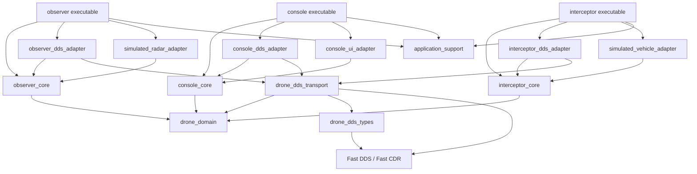

# Libraries

The project shall be split into small C++ libraries with one-way dependencies. In the diagram below, `A --> B` means that library A depends on library B.

The executable nodes are composition roots, not libraries. They shall contain only startup, configuration, and wiring code.

| Library | Responsibility | Direct project dependencies |
| --- | --- | --- |
| `drone_domain` | Participant-neutral domain values and events, including identifiers, positions, target tracks, drone state, assignments, interception commands, and explosion events. It contains no DDS, UI, or simulation code. | None |
| `drone_dds_types` | The IDL definitions and generated C++ wire types used by Fast DDS. Contracts shall describe operational data without referring to simulated or physical equipment. | None |
| `drone_dds_transport` | Shared Fast DDS participant setup, topic names, QoS policy, serialization mappings between DDS wire types and `drone_domain`, and reusable reader/writer support. | `drone_domain`, `drone_dds_types` |
| `observer_core` | Observer use cases and state. It accepts detections through an input port and emits target-track updates through an output port. | `drone_domain` |
| `observer_dds_adapter` | Connects observer output ports to the target-track DDS topics and receives any observer-level DDS input required later. | `observer_core`, `drone_dds_transport` |
| `simulated_radar_adapter` | Produces simulated radar detections through the input port owned by `observer_core`. | `observer_core` |
| `console_core` | Maintains the operator's view of targets, drones, assignments, and outcomes; validates operator actions; and emits assignment and interception commands. | `drone_domain` |
| `console_dds_adapter` | Receives target, drone, and explosion events from DDS and publishes commands produced by `console_core`. | `console_core`, `drone_dds_transport` |
| `console_ui_adapter` | Renders console state and translates human interaction into calls to `console_core`. It owns all UI-framework-specific code. | `console_core` |
| `interceptor_core` | Owns the interceptor state machine, follows the latest assigned target position, requests movement through flight-control ports, reports drone state, and requests the interception effect after reaching the target. | `drone_domain` |
| `interceptor_dds_adapter` | Receives assignments, commands, and target updates from DDS and publishes drone state and interception outcomes. | `interceptor_core`, `drone_dds_transport` |
| `simulated_vehicle_adapter` | Simulates positioning, flight control, and the explosion effect through ports owned by `interceptor_core`. | `interceptor_core` |
| `application_support` | Validates composition-root process configuration and turns operating-system shutdown signals into cooperative loop termination. It contains no application, DDS, UI, or simulation behavior. | None |

All listed dependencies are compile-time dependencies. A library shall also link directly to every target whose public API it uses; it shall not rely on accidental transitive linkage.

The following dependency rules preserve the transition from simulation to hardware:

- `drone_domain` is the innermost library and shall depend only on the C++ standard library.
- The three core libraries shall not depend on Fast DDS, generated DDS types, a UI framework, simulation code, or one another.
- DDS adapters shall be the only participant-specific libraries that know both a participant core and `drone_dds_transport`.
- Simulation and UI adapters shall implement ports declared by their corresponding core libraries. The core libraries shall never include adapter headers.
- A process shall communicate with another participant exclusively through Fast DDS; executables shall never link another participant's core or adapter library.
- Future hardware support shall be added as replacement adapter libraries, such as a physical radar or vehicle adapter, without changing the domain or core libraries.
- The library graph shall remain acyclic.
