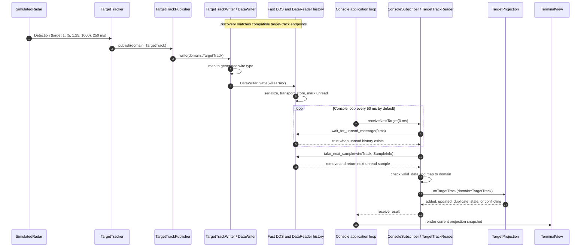

# How a DDS reader knows that data arrived

## Short answer

A DDS `DataWriter` does not call the reader application directly. After compatible endpoints have
matched, Fast DDS receives the writer's sample, places it in the `DataReader` history, and marks it
unread. The application can learn that unread data exists through a listener callback, a condition
attached to a WaitSet, or a reader wait operation. It must then explicitly `read` or `take` the
sample.

This project uses the third approach. `TargetTrackReader::waitForData()` delegates to Fast DDS
`DataReader::wait_for_unread_message()`. Once that returns `true`, the application calls
`take_next_sample()` and validates the accompanying `SampleInfo` before the target track can enter
console core.

Endpoint matching and data arrival are different events. `on_subscription_matched()` says that a
compatible writer exists; it does not say that the writer has published a sample. This project's
target reader overrides matching and incompatible-QoS callbacks, but it does not override
`on_data_available()`.

## Ways to observe available data

Fast DDS supports several application styles. They all observe state maintained by the
`DataReader`; the writer application does not invoke reader application code.

| Mechanism | How application code learns about data | Threading model | Use in this project |
| --- | --- | --- | --- |
| `DataReaderListener::on_data_available()` | Fast DDS invokes a callback when new data becomes available. Several arrivals can be represented by one callback, so callback code must drain all required samples. | Runs on a Fast DDS-managed callback thread; work should stay short and non-blocking. | Not used for target data. The listener handles matching and incompatible QoS only. |
| `WaitSet` with a `StatusCondition` or `ReadCondition` | An application thread blocks until an attached condition is triggered, then reads or takes matching samples. | Application-owned waiting thread. | Not used by the current executables. |
| `DataReader::wait_for_unread_message(timeout)` | The call returns `true` when the reader history contains an unread message and `false` on timeout. | The caller chooses a blocking timeout or a zero-duration poll. | Wrapped by `TargetTrackReader::waitForData()`. The console polls; focused tests wait with a bound. |

See the official Fast DDS documentation for
[`DataReader`](https://fast-dds.docs.eprosima.com/en/3.x/fastdds/api_reference/dds_pim/subscriber/datareader.html),
[`DataReaderListener`](https://fast-dds.docs.eprosima.com/en/3.x/fastdds/dds_layer/subscriber/dataReaderListener/dataReaderListener.html),
and
[`WaitSet` and conditions](https://fast-dds.docs.eprosima.com/en/latest/fastdds/dds_layer/core/waitsets/waitsets.html).

## Radar observation example

The observer publishes target state on the keyed `drone.target_tracks` Topic. The console has a
matching `DataReader` for the same Topic and generated `drone::dds::TargetTrack` type.

The default radar scenario starts target 1 at `(0, 0, 1000)` metres and advances it every 250 ms
with velocity `(20, 5, 0)` metres per second. The first two deterministic observations are:

| Radar tick | Measurement time | Position in metres |
| --- | --- | --- |
| 0 | `0 ms` | `(0.0, 0.0, 1000.0)` |
| 1 | `250 ms` | `(5.0, 1.25, 1000.0)` |

The second row follows directly from `position = initial position + velocity * 0.25 seconds`. That
observation takes this path:



### 1. Endpoints discover and match

The observer's `DataWriter` and console's `DataReader` must use the same DDS domain, Topic name, and
wire type, with compatible QoS. Their target-track endpoints use
`RELIABLE / TRANSIENT_LOCAL / KEEP_LAST(1)`.

Fast DDS reports a compatible endpoint through `on_subscription_matched()` on the reader. This
answers “is there a writer from which this reader can receive?” It does not answer “has a target
sample arrived?” The reader can match before the first radar tick, and a writer can exist without
ever writing.

### 2. The simulated radar creates an observation

[`SimulatedRadar::tick()`](../src/simulated_radar_adapter/simulated_radar.cpp) calculates the next
position and measurement time, then sends a middleware-independent `Detection` through the
observer input port:

```cpp
const auto elapsed = scenario_.tickInterval * tickIndex_;
const auto detectedAt = domain::Timestamp{scenario_.startsAt.timeSinceUnixEpoch() + elapsed};

detectionInput_.onDetection(observer::Detection{
    .targetId = scenario_.targetId, .position = position, .detectedAt = detectedAt});
```

For the default scenario's second tick, this is target 1 at `(5.0, 1.25, 1000.0)` and `250 ms`.

### 3. Observer core creates domain state

[`TargetTracker::onDetection()`](../src/observer_core/target_tracker.cpp) turns the observation into
a `domain::TargetTrack`. Core depends on neither Fast DDS nor the generated wire type:

```cpp
const domain::TargetTrack targetTrack{detection.targetId, detection.position,
                                      detection.detectedAt};
targetTrackOutput_.publish(targetTrack);
```

### 4. The DDS adapter writes the sample

[`TargetTrackPublisher`](../src/observer_dds_adapter/target_track_publisher.cpp) forwards the domain
value to transport. [`TargetTrackWriter`](../src/drone_dds_transport/target_track_writer.cpp) maps
it to the IDL-generated type and gives that value to Fast DDS:

```cpp
auto wireTrack = toWireTargetTrack(track);
const auto returnCode = writer_->write(&wireTrack);
```

A successful `write()` means Fast DDS accepted the value from the observer. It does not mean the
console has taken, validated, or accepted it.

### 5. Fast DDS delivers the sample to reader history

Fast DDS serializes the generated value and transports it to every matched target-track reader.
The console reader stores it in local history as an unread sample for keyed instance `target_id =
1`.

The Topic uses `RELIABLE` delivery, so the middleware detects and repairs transport loss according
to that QoS. `TRANSIENT_LOCAL` also lets a reader that matches later receive the latest retained
target state while the writer remains alive. Neither policy bypasses the reader history or invokes
console core directly.

### 6. The application observes unread history

[`TargetTrackReader::waitForData()`](../src/drone_dds_transport/target_track_reader.cpp) is the
project's direct answer to “how does the reader know?”:

```cpp
bool TargetTrackReader::waitForData(const std::chrono::milliseconds timeout)
{
    return reader_->wait_for_unread_message(toDdsDuration(timeout));
}
```

If an unread sample already exists, the call can return immediately. Otherwise it waits up to the
given timeout. A `false` result means the timeout expired without unread data; it says nothing about
whether a writer is matched.

### 7. The application takes the wire sample

Availability is only a signal to access the reader. `TargetTrackReader::takeNext()` still calls
Fast DDS to obtain the value and metadata:

```cpp
dds::TargetTrack wireTrack;
eprosima::fastdds::dds::SampleInfo sampleInfo{};
const auto returnCode = reader_->take_next_sample(&wireTrack, &sampleInfo);
```

`take_next_sample()` copies the next unread value and removes it from reader history. A `read`
operation would instead leave the sample in history and mark it read. This project uses `take` so
the same update is not processed repeatedly.

### 8. The adapter validates before entering core

`SampleInfo::valid_data` distinguishes a usable value from an instance-state notification such as
disposal. A valid DDS value is then mapped back to `domain::TargetTrack`; the mapping rejects a zero
target ID, non-finite coordinates, or a timestamp before the Unix epoch.

[`ConsoleSubscriber::receiveNextTarget()`](../src/console_dds_adapter/console_subscriber.cpp) passes
only a valid domain value through the console input port:

```cpp
if (!targetReader_.waitForData(timeout))
{
    return std::unexpected{ReceiveIssue::timedOut};
}

auto sample = targetReader_.takeNext();
// Malformed values and invalid-data notifications return distinct errors.
return targetInput_.onTargetTrack(**sample);
```

Data being available therefore does not mean the application accepts it. DDS delivery, valid
sample metadata, wire-to-domain validation, and core acceptance are separate decisions.

### 9. Console core projects and displays current state

[`TargetProjection::onTargetTrack()`](../src/console_core/target_projection.cpp) compares the track
with current state for the same target ID. It reports `added`, `updated`, `duplicate`, `stale`, or
`conflicting`; only a newer value replaces the current track. After a successfully decoded sample
reaches the projection, the terminal view renders the current snapshot even when that sample did
not change it.

The production console uses non-blocking polls from its application-owned loop:

```cpp
const auto received = subscriber.receiveNextTarget(0ms);
```

The loop runs every 50 ms by default. Passing `0ms` makes `wait_for_unread_message()` an immediate
history check, keeping rendering and core work off Fast DDS callback threads. Tests can instead pass
a bounded nonzero timeout to block until data arrives or the test fails clearly.

## Semantics worth remembering

- **Matching is not arrival.** `on_subscription_matched()` reports compatible endpoints; unread
  reader history reports available data.
- **Arrival is not acceptance.** A sample can be an invalid-data notification, fail domain mapping,
  or be rejected by core as duplicate, stale, or conflicting.
- **`take` consumes; `read` retains.** This project takes each target sample from reader history.
- **Notification is not one event per write.** Listener callbacks can coalesce arrivals, and
  wait-based code observes the current history state rather than a count of writer calls.
- **History policy matters.** `KEEP_LAST(1)` retains only the newest sample for each target key. If
  writes outpace the console, an older unread update can be replaced. The design projects the
  latest retained state rather than promising every intermediate radar tick.
- **A timeout is not a disconnect.** It means no unread sample appeared during that wait. Discovery
  status must be checked separately when endpoint connectivity matters.

## Try it

The focused round-trip test exercises endpoint match, write, unread-data wait, take, mapping, and
domain-value comparison:

```bash
cmake --preset development
cmake --build --preset development --target target_track_pub_sub_test
ctest --preset development -R '^TargetTrackPublishSubscribe\.' -V
```

For the live radar path, start the console in one terminal:

```bash
./build/development/console --domain-id 0 --tick-ms 50
```

Then publish 20 observations from another terminal:

```bash
./build/development/observer --domain-id 0 --tick-ms 250 --tick-count 20
```

The console first reports `matched observer TargetTrack writer`, which proves endpoint matching.
The changing target rows appear only after samples enter reader history, are taken and validated,
and update console core. Stop the console with Ctrl-C after the observer finishes.

## Related learning notes

- [19 — First publish/subscribe path](learning/19-first-publish-subscribe.md): DDS entity ownership,
  history, write, and take.
- [20 — Discovery and endpoint matching](learning/20-discovery-and-matching.md): matching Topic,
  type, and QoS contracts.
- [23 — Observer publisher](learning/23-observer-publisher.md): the radar-to-DataWriter side.
- [25 — Console subscriber](learning/25-console-subscriber.md): sample metadata, validation, and
  callback handoff.
- [26 — Terminal view](learning/26-terminal-view.md): the full target path through projection and
  presentation.

## Takeaway

The reader “knows” because Fast DDS records delivered data as unread in its local DataReader
history. In this project, an application-owned console loop checks that state with
`wait_for_unread_message()`, takes the sample, and then applies metadata, mapping, and core rules
before anything is displayed.
