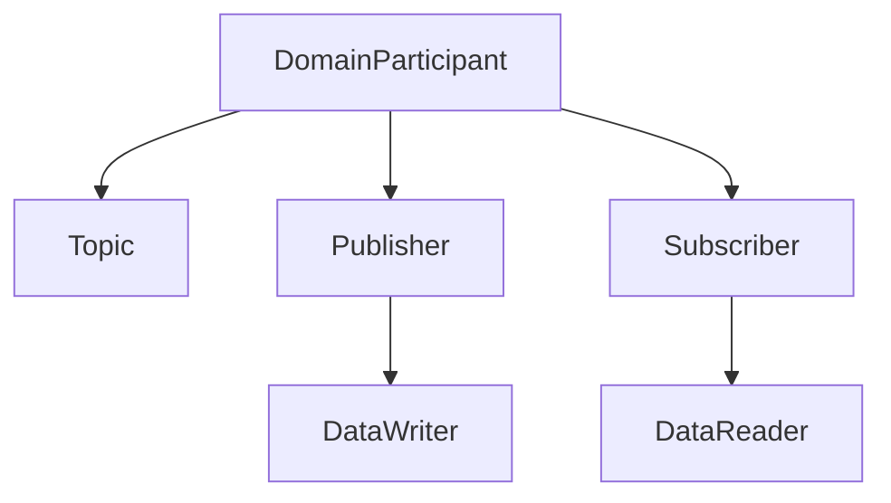

# 18 — Participant lifetime

## Concept

### Why a domain ID?

A DDS domain is a logical communication space selected by a numeric domain ID. `DomainId_t` is the
Fast DDS type used to carry that number. Participants configured with the same domain ID can
discover each other and exchange samples when their Topics, types, and QoS are compatible.
Participants on different domain IDs are isolated, even when they run on the same machine or
physical network.

The observer, console, and interceptor therefore need the same configured domain ID to communicate.
Tests and independent systems can use different IDs to avoid discovering or interfering with one
another. The focused test uses domain `180` as a valid isolated test domain. It also tries `233` to
prove invalid configuration is rejected: with the standard RTPS port calculation used here, Fast
DDS supports domain IDs only through `232`.

### Entity ownership

A `DomainParticipant` is one process's entry point into its selected domain and is the parent of its
Topics, Publishers, and Subscribers. Publishers in turn own DataWriters, while Subscribers own
DataReaders. Fast DDS requires those child entities to be removed before the participant itself can
be deleted.



Ownership flows downward; cleanup follows the arrows upward, from leaf entities to the participant.

That hierarchy makes lifetime order part of correctness. An RAII owner ties cleanup to C++ scope:
its destructor first calls `delete_contained_entities()` and then asks the
`DomainParticipantFactory` to delete the participant. This is the reverse of construction order and
also runs when later startup code exits through an exception.

## In this project

`DomainParticipantOwner` in `drone_dds_transport` accepts an explicit domain ID and non-empty name,
creates the participant through Fast DDS, and throws if creation fails. Its accessor exposes the
live participant to the participant-specific composition roots and adapters that later steps will
build, without depending on any core library.

The focused tests inspect the factory before and after the owner's scope. They prove that the domain
ID and name reach Fast DDS, that successful destruction leaves no participant registered, and that
an invalid default-port configuration is rejected without leaving a partial entity behind. Fast DDS
3.3 calculates standard RTPS ports from the domain ID and cannot use domain IDs above `232` with
that configuration, so the owner validates this limit before entering the middleware. The Fast DDS
[participant creation and deletion guide](https://fast-dds.docs.eprosima.com/en/3.3.x/fastdds/dds_layer/domain/domainParticipant/createDomainParticipant.html)
describes the same factory calls, default-port limit, and required child-before-parent deletion.

## Try it

Build and run the focused lifetime experiments:

```bash
cmake --preset development
cmake --build --preset development --target domain_participant_owner_test
ctest --preset development -R '^DomainParticipantOwner\.'
```

The success case creates a named participant in domain `180`, observes it through the factory, then
observes an empty domain after scope exit. The failure case attempts domain `233`, whose standard
RTPS default ports cannot be assigned, and verifies that construction reports failure without
leaving a participant registered.

## Takeaway

Fast DDS entities form an ownership hierarchy, not a collection of unrelated pointers. Owning the
root with RAII gives every application role one explicit domain configuration and a deterministic
place to tear the hierarchy down from children to parent.
