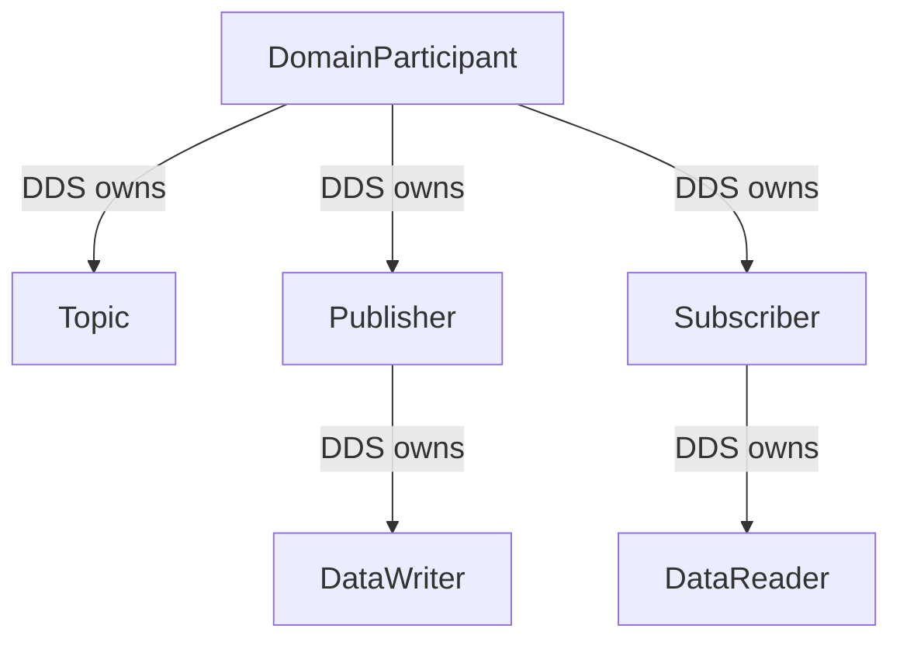
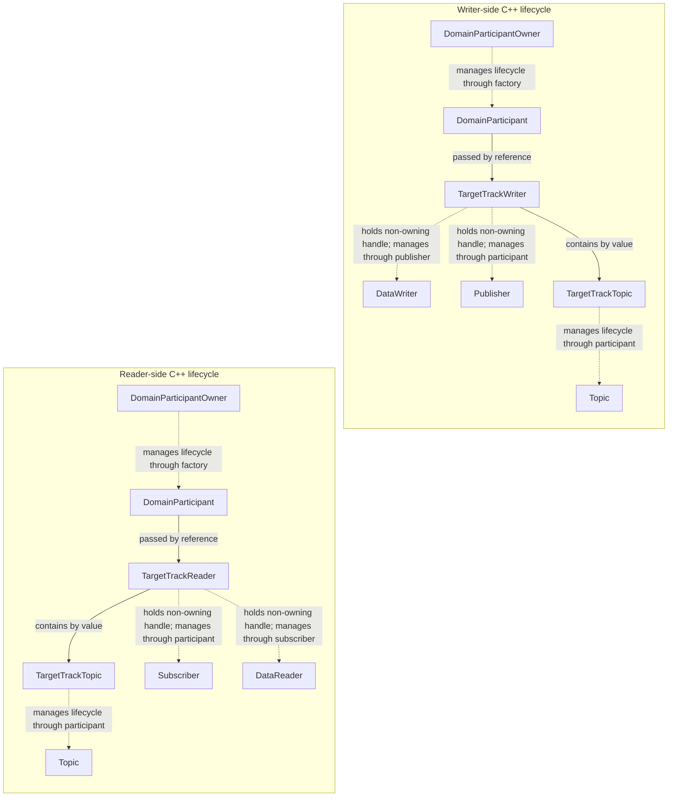

# 19 — First publish/subscribe path

## Concept

DDS data moves through a Data-Centric Publish-Subscribe (DCPS) entity chain. A participant owns a
Publisher and Subscriber. The Publisher owns a DataWriter, the Subscriber owns a DataReader, and
both endpoints bind to a Topic with the same name and registered wire type. Discovery must match
the endpoints before the first deterministic exchange.

Calling `write` gives a sample to the DataWriter; it does not remove anything from a reader. The
DataReader stores delivered samples in its history. Calling `take` copies one unread sample and
removes it from that history. Fast DDS documents these separate operations in its
[DataWriter](https://fast-dds.docs.eprosima.com/en/3.3.x/fastdds/dds_layer/publisher/dataWriter/dataWriter.html)
and
[DataReader](https://fast-dds.docs.eprosima.com/en/3.3.x/fastdds/dds_layer/subscriber/dataReader/dataReader.html)
guides.

## In this project

`TargetTrackWriter` and `TargetTrackReader` in `drone_dds_transport` create only the entity chains
needed by the `drone.target_tracks` Topic. `target_track_topic.cpp` centralizes that Topic's name,
generated `TargetTrack` type registration, and the catalogued
`RELIABLE / TRANSIENT_LOCAL / KEEP_LAST(1)` QoS with its 64-instance resource bounds.

Two different relationships matter here: DDS entity ownership and C++ lifecycle management. They
work together, but they are not the same relationship.

### DDS entity ownership

Fast DDS defines the parent-child hierarchy. The `DomainParticipant` owns its local Topic,
Publisher, and Subscriber entities. A Publisher owns its DataWriters, and a Subscriber owns its
DataReaders. Only the DDS parent creates or deletes each child.



The step 19 test has two participants, so it has two local `Topic` objects with the same Topic name
and registered wire type. Matching connects their compatible DataWriter and DataReader; it does not
make either participant own an entity from the other participant.

### C++ lifecycle management

The project classes make that DDS hierarchy safe to use with C++ scope. They contain references or
raw pointers to middleware entities and call the appropriate DDS parent to create and delete them.
Those pointers are non-owning handles: storing a `Publisher*` in `TargetTrackWriter`, for example,
does not make `TargetTrackWriter` the Publisher's DDS parent.



`TargetTrackTopic` is therefore a C++ RAII helper for type registration and a participant-owned
Topic, not another DDS parent. `TargetTrackWriter` contains that helper and holds non-owning
`Publisher*` and `DataWriter*` handles. Its lifecycle follows the real hierarchy in reverse:

1. `TargetTrackTopic` asks the participant to register the type and create the Topic.
2. `TargetTrackWriter` asks the participant to create the Publisher.
3. The Publisher creates the DataWriter.
4. During cleanup, the Publisher deletes the DataWriter first.
5. The participant then deletes the Publisher.
6. After endpoint cleanup, `TargetTrackTopic` asks the participant to delete the Topic and
   unregister the type.

The reader side is symmetrical: the participant creates and deletes the Subscriber, while the
Subscriber creates and deletes the DataReader. `DomainParticipantOwner` outlives these wrappers and
deletes the participant only after its endpoint and Topic children are gone.

### Sample path

The focused test creates two named participants in domain 181. A DataWriter listener signals a
condition variable when discovery reports a matching reader; there is no startup sleep. After the
match, the writer maps one domain track to the generated wire type and writes it. The reader waits
for unread data with a bounded timeout, takes the wire sample, validates it through the existing
mapping, and compares the resulting domain value with the original.

## Try it

Run only the first data-path experiment from the repository root:

```bash
cmake --preset development
cmake --build --preset development --target target_track_pub_sub_test
ctest --preset development -R '^TargetTrackPublishSubscribe\.'
```

Temporarily comment out `writer.write(sent)` in `tests/target_track_pub_sub_test.cpp` and rerun the
test. The data wait ends at its five-second bound and reports that no unread sample arrived, which
is more actionable than a fixed sleep followed by a mysterious missing sample.

## Takeaway

A DDS write and read are not an in-process function call. Matching first connects compatible
endpoints; writing adds a keyed sample to the data space; taking explicitly consumes delivered data
from the reader's history and maps it back across the transport boundary.
