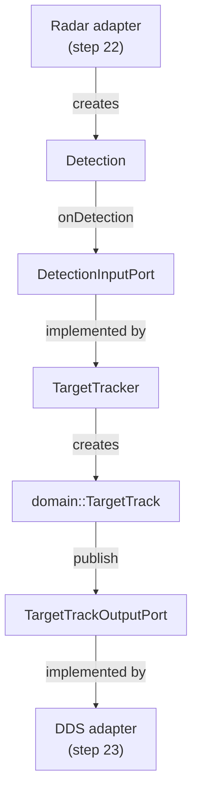

# 21 — Observer ports

## Concept

A port is a small application-facing interface at an architectural boundary. The observer core
accepts detections through an input port and sends target-track updates through an output port. It
therefore depends on the meaning of those values, but not on the device that produced a detection
or the transport that distributes a track.

This boundary matters in a DDS application because Fast DDS is one possible output adapter, not the
place where observation behavior lives. A core use case can be tested with an in-memory output and
later wired to the DDS entity chain without changing its rules.

## In this project

`DetectionInputPort` is the entry point that a radar adapter calls. `TargetTracker` implements that
port and converts each `Detection` into the participant-neutral `TargetTrack` representing the
current measured state. It passes the update to `TargetTrackOutputPort`.



All four types live under `include/drone/observer_core/`; the use-case implementation is in
`src/observer_core/target_tracker.cpp`. The `observer_core` target links only `drone_domain`. The
focused test supplies a capturing output double, so it exercises the complete use case without Fast
DDS, generated wire types, or simulation code.

Step 22 can drive the input port from a deterministic simulated radar. Step 23 can implement the
output port with the existing target-track DataWriter. A physical radar could replace the input
adapter without changing this core path.

## Try it

Run the observer-core tests from the repository root:

```bash
cmake --preset development
cmake --build --preset development --target observer_core_test
ctest --preset development -R '^ObserverCore\.'
```

The two cases submit one detection and then two changing detections. The captured output shows that
every input becomes exactly one track update with the same target, position, and measurement time.
To inspect the library boundary, run:

```bash
ninja -C build/development -t query observer_core
```

Its only direct project-library dependency is `drone_domain`.

## Takeaway

The observer's tracking rule is ordinary deterministic C++ behind explicit ports. Simulation and
DDS will connect to opposite sides of those ports, letting either adapter change without pulling
device or middleware details into the core.
