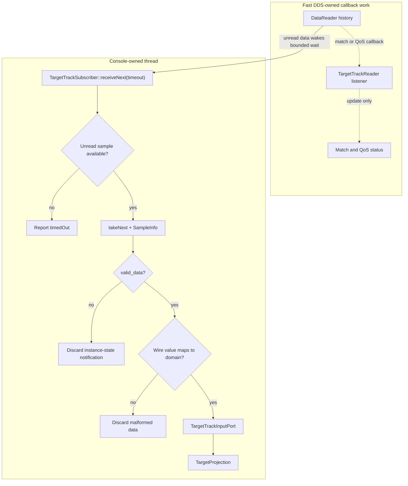

# 25 — Console subscriber

## Concept

A DDS `DataReader` stores received samples until application code reads or takes them. A listener's
`on_data_available` callback can announce that samples arrived, while a condition or bounded reader
wait lets an application-owned thread wait for the same work. Listener callbacks run on middleware
threads, so calling arbitrary application code there can delay DDS receive processing.

Taking a sample also returns `SampleInfo`. Its `valid_data` flag distinguishes a data value from an
instance-state notification, such as disposal. Only valid data should cross the mapping boundary.
Even valid DDS data can still violate domain invariants, so malformed wire values must be rejected
rather than turned into console state. Fast DDS documents these roles in its
[DataReaderListener](https://fast-dds.docs.eprosima.com/en/3.3.x/fastdds/dds_layer/subscriber/dataReaderListener/dataReaderListener.html)
and
[SampleInfo](https://fast-dds.docs.eprosima.com/en/3.3.x/fastdds/dds_layer/subscriber/sampleInfo/sampleInfo.html)
references.

The solid path below is the application data path. The dashed path is the much smaller listener
path: middleware callbacks update discovery status but never enter console core.



## In this project

`console_dds_adapter::TargetTrackSubscriber` owns the console participant and target-track reader.
Its `receiveNext` method performs a bounded wait, takes one sample, and invokes
`TargetTrackInputPort` only after `TargetTrackReader::takeNext` has checked `valid_data` and mapped a
well-formed wire value. A successful result preserves the projection's added, updated, duplicate,
stale, or conflicting outcome. Timeout, malformed data, and instance-state notifications are
reported as distinct receive issues.

The target reader's listener remains limited to discovery status. Core work therefore runs on the
caller-owned console thread, not a Fast DDS callback thread. No background worker needs to be
stopped or joined: the caller chooses a finite receive timeout, and member destruction then removes
the reader, subscriber, topic, type registration, and participant in dependency order. The console
core still has no Fast DDS or generated-type dependency.

## Try it

Run the focused adapter experiments from the repository root:

```bash
cmake --preset development
cmake --build --preset development --target console_dds_adapter_test
ctest --preset development -R '^ConsoleDdsAdapter\.' -V
```

The first case waits for endpoint matching, writes one domain track, and verifies that it appears in
the real console projection. The second writes a zero-key wire sample, then a valid sample, then a
DDS disposal notification. The projection changes only for the valid sample. The final case waits
without a writer and observes a bounded timeout before normal RAII shutdown.

## Takeaway

Receiving a DDS sample is not the same as accepting application state. The adapter owns waiting,
taking, `SampleInfo` checks, wire validation, and DDS lifetime; console core receives only valid
domain values on an application-controlled thread.
