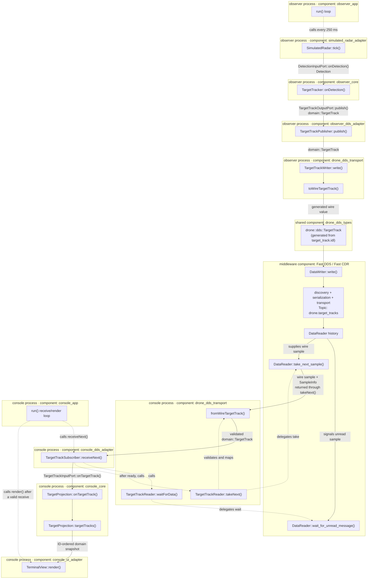

# 26 — Terminal view

## Concept

A console needs presentation code, but presentation is not part of the distributed data contract.
DDS delivers typed target samples, console core decides which sample is current, and a UI adapter
chooses how that current state looks to an operator. Keeping those responsibilities separate means
that a graphical UI can later replace the terminal without changing target projection or DDS
transport code.

Presentation also stays off middleware callback threads. Fast DDS callbacks are kept to short
discovery notifications; the console-owned process loop performs the bounded receive, lets core
apply the update, and then renders the resulting snapshot. Slow terminal output therefore does not
block a Fast DDS receive callback. The Fast DDS
[DataReaderListener documentation](https://fast-dds.docs.eprosima.com/en/3.3.x/fastdds/dds_layer/subscriber/dataReaderListener/dataReaderListener.html)
describes why listener callbacks should remain fast.

## In this project

The observer and console never call each other directly. A target update travels between the two
processes through Fast DDS on the `drone.target_tracks` Topic:



Each enclosing box names the component that owns the class or function. Solid arrows follow the
target data or its availability notification; dashed arrows show control-only calls and scheduling.

One update follows these steps:

1. The `observer_app` component constructs a `TargetTrackPublisher`, gives it to `TargetTracker` as
   the core output port, and gives the tracker to `SimulatedRadar` as the detection input port.
2. In `simulated_radar_adapter`, each `SimulatedRadar::tick()` calculates the target's next position
   and measurement time, then submits a `Detection` through the observer input port.
3. In `observer_core`, `TargetTracker::onDetection()` creates a middleware-independent
   `domain::TargetTrack` and calls the output port. The `observer_dds_adapter` implementation,
   `TargetTrackPublisher::publish()`, forwards the value to `drone_dds_transport`.
4. In `drone_dds_transport`, the writer maps the domain value to the IDL-generated
   `drone::dds::TargetTrack` from `drone_dds_types`, then calls Fast DDS `DataWriter::write()`. The
   wire value contains the keyed target ID, position, and measurement time.
5. Fast DDS discovers the console's matching DataReader and carries the serialized sample. Both
   processes must use the same DDS domain ID, Topic name, wire type, and compatible QoS. The Topic
   uses reliable delivery, transient-local durability, and `KEEP_LAST(1)` per target key.
6. The `console_app` loop calls `console_dds_adapter::TargetTrackSubscriber::receiveNext()` with a
   bounded timeout. Its `drone_dds_transport` reader takes the sample, checks
   `SampleInfo::valid_data`, rejects malformed wire values, and maps valid data back to
   `domain::TargetTrack`. This work does not run in a middleware callback.
7. The subscriber passes the domain value through `TargetTrackInputPort` to the `console_core`
   `TargetProjection`. Core keeps the latest track by target ID and rejects duplicate, stale, or
   conflicting updates.
8. `console_ui_adapter::TerminalView` reads the projection's ID-ordered snapshot and writes a
   plain-text table with position in metres and measurement time in milliseconds. Fixed numeric
   formatting and immediate flushing make the output stable and useful in both a terminal and
   redirected process logs.

The `console` executable is only the composition root and process loop: target freshness, DDS
mapping, and formatting remain in their respective libraries. No operator-command behavior is
introduced in this step. Fast DDS owns discovery, serialization, and transport; the application
owns producing, validating, projecting, and displaying the data.

## Try it

Run the focused rendering checks from the repository root:

```bash
cmake --preset development
cmake --build --preset development --target console_ui_adapter_test console
ctest --preset development -R '^TerminalView\.' -V
```

For a live view, start the console in one terminal:

```bash
./build/development/console --domain-id 0
```

Then publish a finite moving-target scenario in another terminal:

```bash
./build/development/observer --domain-id 0 --tick-count 20
```

The first process prints an empty snapshot and then successive snapshots for target 1. Both
processes must use the same DDS domain ID; stop the continuously running console with Ctrl-C.

## Takeaway

The terminal does not render DDS wire samples directly. A sample first crosses the transport
adapter and console-core projection boundary, then a replaceable UI adapter renders stable
application state on an application-owned thread.
